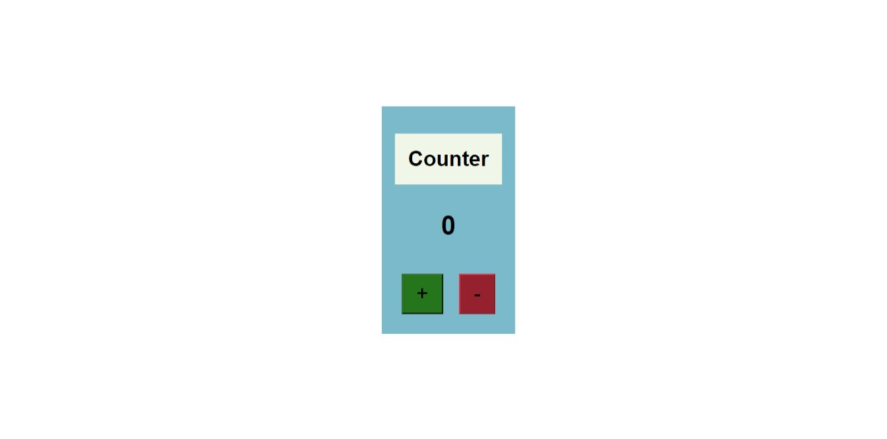

# Counter App

A simple counter application built using **HTML**, **CSS**, and **JavaScript**. It allows users to increment and decrement a number using buttons.

## Features

- **Increment**: Increase the counter value by clicking the "+" button.
- **Decrement**: Decrease the counter value by clicking the "−" button.
- Counter value displayed dynamically.
- Minimal and clean design using raw **CSS**.

---

## Demo



---

## Technologies Used

- **HTML5**: Structure of the application.
- **CSS3**: Styling of the user interface.
- **JavaScript**: Functionality to handle increment and decrement operations.

---

## How to Use

1. Clone or download the project folder.
2. Open the `index.html` file in any modern browser.
3. Use the **+** button to increment the counter.
4. Use the **−** button to decrement the counter.

---

## File Structure

```plaintext
counter-app/
│
├── index.html   # HTML structure
├── styles.css   # CSS for styling
└── script.js    # JavaScript for functionality
```

---

Feel free to customize it further! 🎉